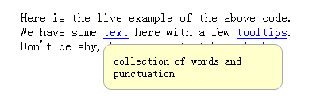

## label标签

### 含义
html中的label标签代表用户界面中的一个条目的题目。

### 属性
1. for属性：for属性指向与label标签在同一个文档中的相关元素。文档中第一个ID值为for属性值的元素即为这个label标签的标签控件。
2. form属性(**HTML5中已删除该属性**)：form属性指向与label标签相联系的form元素，form属性的值为相联系的form元素的ID。这个属性可以使label标签放在文档的任意位置，而不是必须作为相联系的form元素的后代。虽然form属性已经被移出，但是在脚本中还是可以通过HTMLLabelElement.form这个只读属性获取到与label相联系的form表单元素，若form属性未设置或者所指向的不是form元素，则返回null。

### 用法
1. 可以将label的标签控件直接包裹在label标签内部，如下所示：
```
<label>姓名
    <input type="text">
</label>
```
2. 使用for属性。此时标签控件不用必须放在label标签内部。
```
<label for="user-name">姓名</label>
<input type="text" id="user-name">
```
### 注意
1. 当点击label标签时，相关联的标签控件会获得焦点，如text input会聚焦，radio、checkbox input会被选中
2. 一个标签控件可以与多个label绑定

### 自定义checkbox,radio的原理
根据上面注意的第一条，可以将原checkbox或者radio隐藏，用label代替需要显示的单选框或复选框。在label上使用精灵图片设置背景图片，或者使用::after伪元素设置相关样式。然后使用:checked伪类控制选中或未选中时的样式。

## background-position属性
### 含义：该属性为设置了background-image属性的元素设置背景图片的初始位置。

### 取值
一个到四个与元素盒子的边缘相关的2D位置的值
1. 默认值 0% 0%
2. 关键词： top|bottom|left|right|center
3. 百分制：
4. 如果只设置了一个值，该值用于设置横坐标，纵坐标默认50%

[参考资料:http://blog.csdn.net/JeamKing/article/details/5617088](http://blog.csdn.net/JeamKing/article/details/5617088)

## ::after伪元素(::before同理)
### 含义
::after伪元素匹配被选元素的一个虚拟的最后子元素，通常用来使用css属性来添加元素的修饰内容。默认是行内元素。

CSS2中伪元素是一个冒号，在CSS3中伪元素是两个冒号，目的是用来区别伪元素(两个冒号)和伪类(一个冒号)。

### 实例
1. 添加装饰性内容
```
<span class="ribbon">Notice where the orange box is.</span>
<style>
    .ribbon {
        background-color: #5BC8F7;
    }
    .ribbon::after {
        content: "Look at this orange box.";
        background-color: #FFBA10;
        border-color: black;
        border-style: dotted;
    }
</style>
```

2. 添加tooltips
```
<p>Here is the live example of the above code.<br />
  We have some <span data-descr="collection of words and punctuation">text</span> here with a few
  <span data-descr="small popups which also hide again">tooltips</span>.<br />
  Don't be shy, hover over to take a <span data-descr="not to be taken literally">look</span>.
</p>
<style>
    span[data-descr] {
        position: relative;
        text-decoration: underline;
        color: #00F;
        cursor: help;
    }
    span[data-descr]:hover::after {
        content: attr(data-descr);
        position: absolute;
        left: 0;
        top: 24px;
        min-width: 200px;
        border: 1px #aaaaaa solid;
        border-radius: 10px;
        background-color: #ffffcc;
        padding: 12px;
        color: #000000;
        font-size: 14px;
        z-index: 1;
    }
</style>
```

3. 绘制对号等icon
```
li::before {
  content: '';
  width: 0.5em;
  height: 1em;
  position: absolute;
  left: 0.6em;
  border-color: #009933;
  border-style: solid;
  border-width: 0 0.3em 0.25em 0;
  transform: rotate(45deg);
}
```

